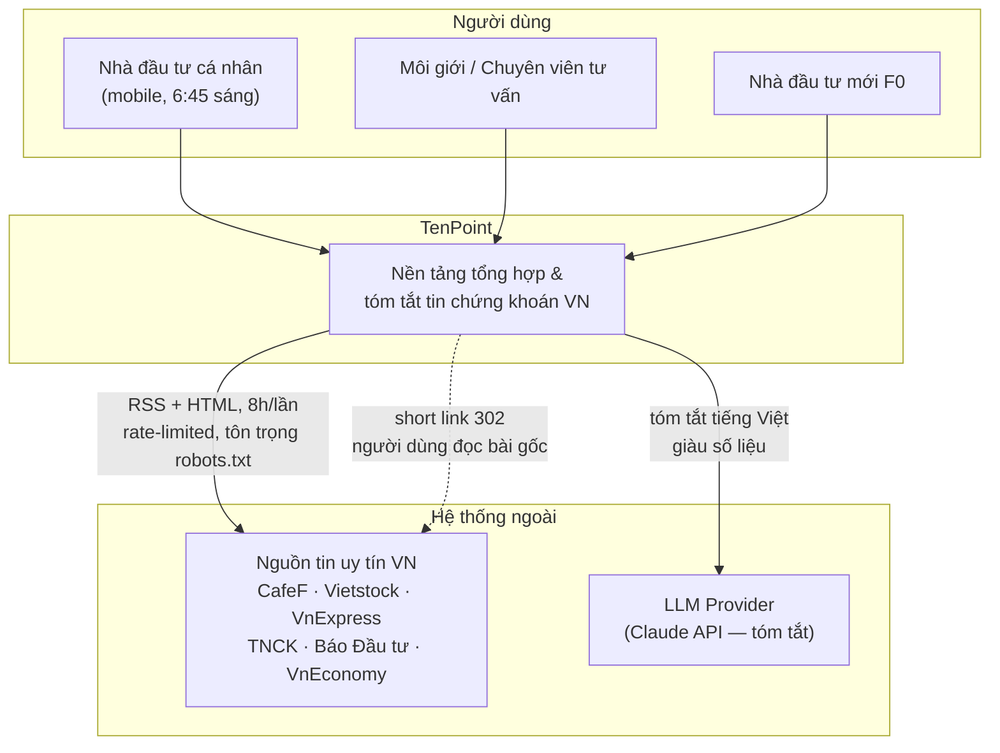
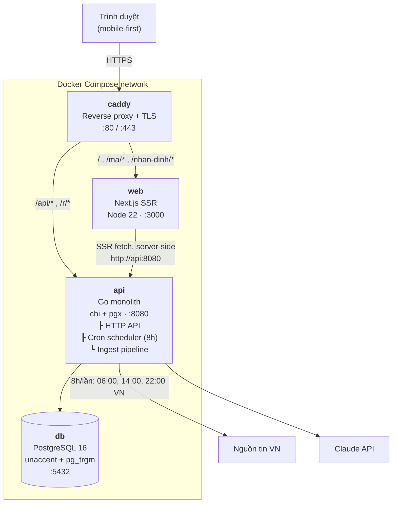
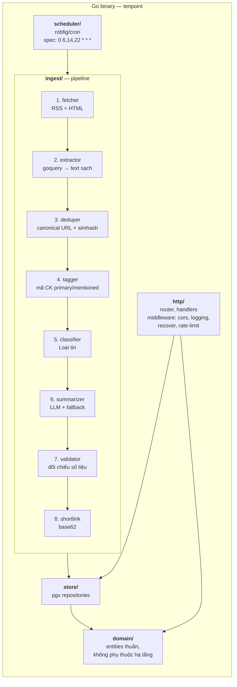
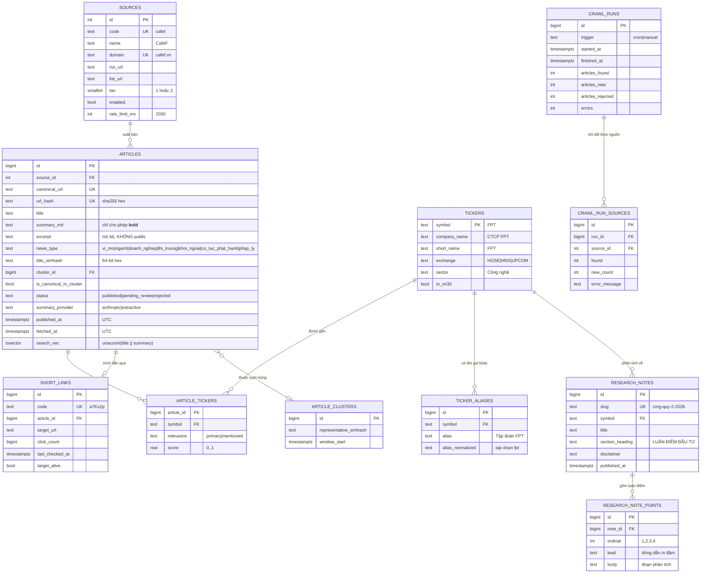
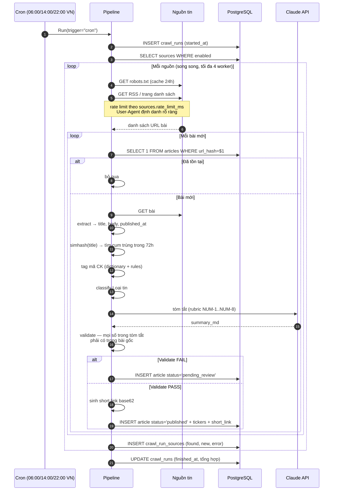
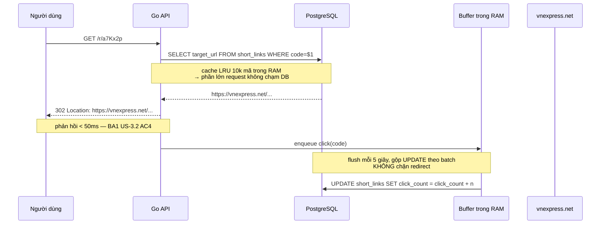

# TenPoint — Kiến trúc hệ thống (SA)

> Tài liệu kiến trúc cho toàn team: BE, FE, DevOps, QA.
> Đầu vào: `docs/00-inputs/reference-images.md`, `docs/01-ba/BA1-users-and-usecases.md`, `docs/01-ba/BA3-market-differentiation-business.md`, `docs/04-design/design-system.md`.

---

## 1. Bối cảnh hệ thống (C4 — Level 1)



**Ranh giới hệ thống:** TenPoint **không** lưu và **không** hiển thị công khai full-text bài gốc. Chỉ lưu bản tóm tắt do hệ thống sinh ra + metadata + link về nguồn. Xem ADR-006.

---

## 2. Kiến trúc container (C4 — Level 2)



| Container | Công nghệ | Trách nhiệm | Scale |
|---|---|---|---|
| `caddy` | Caddy 2 | TLS tự động, reverse proxy, gzip/br, security headers | 1 |
| `web` | Next.js (App Router, SSR) | Render HTML cho SEO, không giữ state nghiệp vụ | n (stateless) |
| `api` | Go 1.26, chi, pgx | REST API + cron + ingest + short link redirect | 1 (xem ADR-002) |
| `db` | PostgreSQL 16 | Nguồn sự thật duy nhất | 1 + volume |

**Vì sao Next.js gọi API qua tên service nội bộ `api:8080`:** SSR chạy server-side trong Docker network, không đi vòng qua Caddy → giảm 1 hop, không lộ API ra ngoài trừ đường `/api/*` được proxy có chủ đích.

---

## 3. Thành phần bên trong `api` (C4 — Level 3)



### Cấu trúc thư mục Go

```
backend/
├── cmd/
│   ├── api/main.go             # khởi động HTTP server + cron
│   └── ingest/main.go          # CLI chạy pipeline 1 lần (debug/backfill)
├── internal/
│   ├── config/                 # nạp env, validate cấu hình
│   ├── domain/                 # Article, Ticker, Source, ShortLink, ResearchNote (thuần)
│   ├── store/                  # postgres repositories (pgx)
│   ├── http/                   # router, handlers, dto, middleware
│   ├── ingest/
│   │   ├── fetcher/            # rss.go, html.go, robots.go, ratelimit.go
│   │   ├── extractor/          # readability-lite bằng goquery
│   │   ├── dedupe/             # canonical.go, simhash.go
│   │   ├── tagger/             # ticker detection (dictionary + rules)
│   │   ├── classifier/         # news type
│   │   ├── summarizer/         # provider interface: anthropic.go, extractive.go
│   │   └── pipeline.go         # điều phối 8 bước
│   ├── shortlink/              # sinh mã base62, allowlist domain
│   └── scheduler/              # cron wiring
├── migrations/                 # 0001_init.sql, 0002_seed.sql, ...
└── testdata/                   # HTML mẫu để test extractor/tagger offline
```

**Quy tắc phụ thuộc (Clean Architecture):** `domain` không import gì; `store`/`ingest`/`http` import `domain`; `domain` **không bao giờ** import `store`. Nhờ vậy QA test được `tagger`, `dedupe`, `validator` hoàn toàn offline, không cần DB.

---

## 4. Mô hình dữ liệu (ERD)



### Index bắt buộc

| Bảng | Index | Phục vụ |
|---|---|---|
| `articles` | `(published_at DESC) WHERE status='published'` | Trang digest — truy vấn nóng nhất |
| `articles` | `UNIQUE (url_hash)` | Chặn trùng khi ingest |
| `articles` | `GIN (search_vec)` | Tìm kiếm toàn văn không dấu |
| `articles` | `(news_type, published_at DESC)` | Lọc theo Loại tin |
| `article_tickers` | `(symbol, article_id)` + `(article_id)` | Lọc theo mã CK |
| `short_links` | `UNIQUE (code)` | Redirect `/r/{code}` |
| `ticker_aliases` | `(alias_normalized)` | Tagger tra cứu tên công ty |

### Tìm kiếm tiếng Việt không dấu

```sql
CREATE EXTENSION IF NOT EXISTS unaccent;
CREATE EXTENSION IF NOT EXISTS pg_trgm;

ALTER TABLE articles ADD COLUMN search_vec tsvector
  GENERATED ALWAYS AS (
    to_tsvector('simple', unaccent(coalesce(title,'') || ' ' || coalesce(summary_md,'')))
  ) STORED;
```

> Dùng `'simple'` chứ không phải `'english'` — tiếng Việt không có stemmer trong Postgres, và `unaccent` cho phép gõ "chung khoan" tìm được "chứng khoán" (BA1 US-2.4).

---

## 5. Pipeline ingest — Sequence



**Chịu lỗi:** mỗi nguồn chạy trong goroutine riêng có `recover()`. Một nguồn chết **không** làm hỏng cả run (BA1 US-6.1 AC2). Lỗi ghi vào `crawl_run_sources.error_message`.

**Chống chạy chồng:** `pg_try_advisory_lock` đảm bảo chỉ 1 pipeline chạy tại một thời điểm, kể cả khi có người bấm ingest thủ công đúng lúc cron chạy.

---

## 6. Hợp đồng API (REST v1)

Base: `/api/v1` · Content-Type: `application/json; charset=utf-8` · Thời gian: ISO-8601 UTC.

### `GET /api/v1/news` — Danh sách tin cho bảng digest

| Query param | Kiểu | Mặc định | Mô tả |
|---|---|---|---|
| `ma` | csv | — | Lọc theo mã: `FPT,HPG` (logic OR) |
| `relevance` | enum | `primary` | `primary` \| `all` (gồm cả mã được nhắc tới) |
| `loai` | csv | — | `vi_mo,nganh,doanh_nghiep,thi_truong,khoi_ngoai,co_tuc_phat_hanh,phap_ly` |
| `tu` / `den` | date | 7 ngày gần nhất | `2026-08-20` (theo giờ VN) |
| `q` | string | — | Tìm toàn văn, không phân biệt dấu |
| `limit` | int | `20` | Tối đa `100` |
| `offset` | int | `0` | |

```jsonc
// 200 OK
{
  "data": [
    {
      "id": 1042,
      "published_at": "2026-08-26T01:30:00Z",
      "published_date_vn": "26/08/2026",
      "title": "12 ngân hàng cam kết 408.000 tỷ đồng tín dụng cho DNNVV",
      "summary_md": "12 ngân hàng cam kết **408.000 tỷ đồng** tín dụng cho DNNVV theo chương trình NHNN chủ trì. Big4 đăng ký 220.000 tỷ...",
      "news_type": "nganh",
      "news_type_label": "Ngành",
      "tickers": [
        { "symbol": "BID", "relevance": "primary" },
        { "symbol": "VCB", "relevance": "primary" }
      ],
      "source": { "name": "VnExpress", "domain": "vnexpress.net", "tier": 1 },
      "short_link": "/r/a7Kx2p"
    }
  ],
  "meta": { "total": 143, "limit": 20, "offset": 0, "has_more": true }
}
```

> **Lưu ý cho FE:** API trả `summary_md` (markdown thô, chỉ chứa `**...**`). FE **phải** sanitize, chỉ cho phép `<strong>`/`<em>` — BA1 US-1.2 AC2. API **không** trả HTML.

### Các endpoint còn lại

| Method | Path | Mô tả | Mã trả về |
|---|---|---|---|
| `GET` | `/api/v1/news/{id}` | Chi tiết 1 tin + các tin cùng cụm trùng | `200` `404` |
| `GET` | `/api/v1/tickers` | Danh sách mã (cho ô lọc/autocomplete) | `200` |
| `GET` | `/api/v1/tickers/{symbol}` | Thông tin mã + tin gần đây + research notes | `200` `404` |
| `GET` | `/api/v1/notes` | Danh sách research note | `200` |
| `GET` | `/api/v1/notes/{slug}` | 1 research note + các luận điểm | `200` `404` |
| `GET` | `/api/v1/meta` | `last_crawl_at`, `is_stale`, tổng số tin, loại tin kèm số lượng | `200` |
| `GET` | `/r/{code}` | **Short link** → `302`, đếm click bất đồng bộ | `302` `404` `410` |
| `GET` | `/healthz` | Liveness | `200` |
| `GET` | `/readyz` | Readiness — kiểm tra DB + độ tươi dữ liệu | `200` `503` |
| `POST` | `/api/v1/admin/ingest` | Chạy pipeline thủ công (Bearer token) | `202` `401` `409` |

### Hình dạng response của các endpoint chi tiết

> **Bổ sung 16/09 sau defect P0-1.** Bản đầu của mục 6 chỉ liệt kê đường dẫn và mã trả về, **không đặc tả hình dạng response** của ba endpoint dưới đây. Hậu quả: BE và FE mỗi bên tự nghĩ ra một kiểu, `tsc` không bắt được vì FE ép kiểu `as T`, và hai trang `/ma/{mã}` với `/nhan-dinh/{slug}` trả HTTP 500 suốt cho tới khi QA dựng hệ thống thật.
>
> Bài học: liệt kê endpoint là chưa đủ. Endpoint nào có hình dạng riêng thì **phải viết ra JSON mẫu**, nếu không hai đầu sẽ lệch.

**`GET /api/v1/tickers/{symbol}`** — thông tin mã phẳng ở cấp ngoài, kèm hai danh sách:

```jsonc
{
  "data": {
    "symbol": "FPT", "company_name": "CTCP FPT", "short_name": "FPT",
    "exchange": "HOSE", "sector": "Công nghệ", "in_vn30": true, "article_count": 12,
    "recent_news": [ /* NewsItem, y hệt phần tử của /api/v1/news */ ],
    "research_notes": [ /* NoteItem */ ]
  }
}
```

**`GET /api/v1/notes/{slug}`** — `NoteItem` phẳng, cộng `disclaimer` và `points`:

```jsonc
{
  "data": {
    "slug": "cmg-quy-2-2026", "symbol": "CMG",
    "title": "CMG – QUÝ 2/2026: DOANH THU TIẾP TỤC TĂNG...",
    "section_heading": "LUẬN ĐIỂM ĐẦU TƯ",
    "published_at": "2026-08-27T02:00:00Z", "published_date_vn": "27/08/2026",
    "disclaimer": "Nội dung chỉ mang tính thông tin, không phải khuyến nghị đầu tư.",
    "points": [ { "ordinal": 1, "lead": "Hoạt động kinh doanh cốt lõi...", "body": "Q2/2026..." } ]
  }
}
```

> Research note được định danh bằng **`slug`**, không có trường `id`.
> BE **không** trả `related_symbols`; FE tự suy ra từ `symbol` của bài.

**`GET /api/v1/meta`** — lưu ý khoá là `value`, không phải `news_type`:

```jsonc
{
  "data": {
    "last_crawl_at": "2026-09-16T23:00:00Z", "is_stale": false, "total_articles": 192,
    "news_types": [ { "value": "nganh", "label": "Ngành", "count": 37 } ]
  }
}
```

**Quy tắc cho mọi thay đổi sau này:** FE **không được** ép kiểu response bằng `as T`. Mọi payload từ API phải đi qua hàm ánh xạ có kiểm chứng runtime trong `frontend/src/lib/api.ts`; hình dạng sai thì rơi về fixture, không bao giờ để văng ra lỗi 500.

### Định dạng lỗi thống nhất

```jsonc
{ "error": { "code": "not_found", "message": "Không tìm thấy tin này." } }
```

Thông điệp lỗi **bằng tiếng Việt** vì hiển thị trực tiếp cho người dùng.

---

## 7. Kiến trúc Short Link



**Sinh mã:** base62 (`0-9A-Za-z`) 6 ký tự = 56,8 tỷ tổ hợp, lấy từ `crypto/rand`, retry khi đụng UNIQUE.

**Chống open redirect (BA1 US-3.3):** trước khi INSERT, domain đích **bắt buộc** khớp `sources.domain` (hoặc subdomain của nó). URL ngoài allowlist bị từ chối và ghi log cảnh báo. Không có biện pháp này, `/r/{code}` trở thành công cụ phishing.

---

## 8. Ticker Tagging — thuật toán

Ba tầng chạy tuần tự, kết quả hợp nhất:

| Tầng | Cách làm | Ví dụ | Điểm |
|---|---|---|---|
| **T1 — Mã trực tiếp** | Regex `\b[A-Z]{3}\b` đối chiếu bảng `tickers` | "FPT +2,69%" → `FPT` | 0.9 |
| **T2 — Tên doanh nghiệp** | Khớp `ticker_aliases.alias_normalized` (bỏ dấu + lowercase) | "Hoà Phát" → `HPG`, "Vietcombank" → `VCB` | 0.8 |
| **T3 — Ngữ cảnh ngành** | Từ khoá ngành → nhóm mã, **chỉ gán `mentioned`** | "ngành thép" → `HPG,HSG,NKG,TIS` | 0.4 |

> T3 chính là cơ chế cho phép tin CBAM (không nhắc tên mã nào) vẫn gắn đúng `HPG/HSG/NKG/TIS` như trong ảnh tham chiếu — BA3 xác định đây là một trong những khác biệt cốt lõi của sản phẩm.

**Phân định `primary` vs `mentioned`** (giải quyết Q3 của BA1):

```
primary   ⟸ mã xuất hiện trong TIÊU ĐỀ
          ∨ xuất hiện ≥ 2 lần trong thân bài
          ∨ xuất hiện trong đoạn đầu tiên
mentioned ⟸ mọi trường hợp còn lại
```

**Xử lý nhập nhằng (bắt buộc, nếu thiếu sẽ tag sai hàng loạt):**

| Bẫy | Cách xử lý |
|---|---|
| `VIC` trong "VIC Group" (nước ngoài) vs mã VIC | Cần ≥ 1 từ khoá ngữ cảnh CK trong câu: `cổ phiếu, mã, phiên, khớp lệnh, tăng, giảm, đồng/cp` |
| `USD`, `GDP`, `CPI`, `EU`, `AI`, `MW`, `ATC`, `HOSE`, `HNX`, `CEO`, `USD` | Blacklist cứng — không bao giờ coi là mã |
| `TIS` viết tắt của tổ chức khác | Yêu cầu ngữ cảnh như trên |
| Mã nằm trong URL hoặc tên file | Chỉ quét text đã extract, không quét raw HTML |

**Vì sao dùng từ điển thay vì LLM để tag mã:** tag mã phải **tất định và kiểm chứng được** — QA cần chạy lại cho ra đúng kết quả. LLM chỉ dùng cho tóm tắt (việc sáng tạo), không dùng cho phân loại xác định. Xem ADR-005.

---

## 9. Summarizer — thiết kế provider

```go
// internal/ingest/summarizer/summarizer.go
type Provider interface {
    Name() string
    Summarize(ctx context.Context, in Input) (Output, error)
}

type Input struct {
    Title      string
    Body       string
    SourceName string
    Tickers    []string
}

type Output struct {
    SummaryMD string   // chỉ chứa **bold**, không HTML
    BoldSpans []string // các cụm được bold, để validator kiểm tra
}
```

| Provider | Khi nào dùng | Ghi chú |
|---|---|---|
| `anthropic` | Khi có `ANTHROPIC_API_KEY` | Model `claude-sonnet-5`. Prompt ép rubric NUM-1..NUM-8 của BA1 |
| `extractive` | Fallback mặc định — **không cần API key** | Chọn câu giàu số liệu nhất bằng heuristic: mật độ số + đơn vị tiền tệ + vị trí câu. Bold cụm số lớn nhất |

> **Quyết định kiến trúc quan trọng:** hệ thống **phải chạy được end-to-end mà không cần API key nào**. `extractive` là mặc định. Nhờ đó QA test offline được, DevOps deploy demo được, người dùng dùng thử ngay được. Nâng chất lượng tóm tắt chỉ là thêm 1 biến môi trường.

### Validator số liệu (BA1 Q5 / NUM-4) — chặn LLM bịa số

```
1. Trích mọi token số từ summary_md:  regex  [0-9][0-9.,]*
2. Chuẩn hoá: bỏ dấu phân nhóm nghìn "." và đổi "," thập phân → "."
3. Với mỗi số, kiểm tra có tồn tại trong body gốc (đã chuẩn hoá tương tự)
4. Nếu có bất kỳ số nào KHÔNG truy vết được → status = 'pending_review', KHÔNG publish
5. Ghi log số bị lệch để QA rà soát
```

BA3 xếp "ảo giác số liệu" vào nhóm rủi ro **mức tồn vong**. Đây là hàng rào an toàn quan trọng nhất của sản phẩm.

---

## 10. Quyết định kiến trúc (ADR)

| # | Quyết định | Lý do | Đánh đổi |
|---|---|---|---|
| **ADR-001** | **PostgreSQL** thay vì MongoDB/SQLite | Cần `unaccent`+`pg_trgm` cho tiếng Việt, quan hệ nhiều-nhiều article↔ticker, giao dịch khi ingest | Nặng hơn SQLite; chấp nhận vì cần full-text tiếng Việt |
| **ADR-002** | **Monolith Go 1 binary**, cron nằm trong process API | Quy mô MVP: 3 run/ngày, vài nghìn bài. Microservices ở đây chỉ tạo chi phí vận hành | Không scale API ngang khi cron chạy → xử lý bằng advisory lock; tách worker ở v2 |
| **ADR-003** | **Next.js SSR** thay vì SPA thuần | SEO là kênh tăng trưởng chính (BA3: ~14.600 internal link/năm từ trang `/ma/{mã}`); LCP tốt trên 4G | Thêm 1 container Node |
| **ADR-004** | **Cron `0 6,14,22` giờ VN** | 8h/lần theo yêu cầu, đặt đúng 3 thời điểm người dùng cần: trước phiên / trước ATC / sau phiên (BA1 mục 8) | Không bắt tin nóng giữa 2 mốc → có `/admin/ingest` thủ công |
| **ADR-005** | **Tag mã CK bằng từ điển + luật**, không dùng LLM | Tất định, kiểm chứng được, rẻ, chạy offline | Cần bảo trì bảng alias khi có mã mới |
| **ADR-006** | **Không lưu/hiển thị công khai full-text bài gốc** | Bản quyền báo chí VN. BA3: dữ kiện không được bảo hộ, cách diễn đạt mới được bảo hộ → đầu ra phải là bảng dữ kiện, không phải bài rút gọn | Không tìm kiếm toàn văn bài gốc; `excerpt` chỉ dùng nội bộ cho validator |
| **ADR-007** | **Summarizer có fallback không cần API key** | Hệ thống phải chạy ngay sau `docker compose up` | Chất lượng tóm tắt mặc định thấp hơn LLM |
| **ADR-008** | **Short link `/r/{code}` nội bộ + allowlist domain** | Đo click (KPI của BA3), giữ URL ngắn trong bảng, chặn phishing | Thêm 1 hop; bù bằng cache LRU |
| **ADR-009** | **Dedupe bằng simhash tiêu đề, cửa sổ 72h**, không dùng embedding | Rẻ, tất định, đủ tốt vì báo VN hay copy tiêu đề gần giống | Bỏ sót trường hợp viết lại hoàn toàn khác |
| **ADR-010** | **Không đăng nhập ở v1**, watchlist `localStorage` | Bỏ toàn bộ chi phí auth khỏi MVP | Không đồng bộ đa thiết bị |

---

## 11. Yêu cầu phi chức năng & cách đáp ứng

| NFR | Chỉ tiêu | Cách kiến trúc đáp ứng |
|---|---|---|
| Thời gian phản hồi API | p95 < 200ms cho `/api/v1/news` | Index `(published_at DESC) WHERE status='published'`; `limit ≤ 100` |
| Short link | < 50ms | Cache LRU + đếm click bất đồng bộ (mục 7) |
| LCP trang digest | < 2.0s trên 4G | SSR + font self-host + không JS chặn render |
| Pipeline | 1 run < 10 phút | 4 worker song song theo nguồn, timeout 20s/bài |
| Chịu lỗi | 1 nguồn chết không hỏng run | goroutine + recover + ghi lỗi theo nguồn |
| Chạy chồng | Không bao giờ 2 pipeline cùng lúc | `pg_try_advisory_lock` |
| Lịch sự với nguồn | Không bị chặn IP | Tôn trọng `robots.txt`, rate limit theo nguồn, User-Agent định danh, `If-Modified-Since` |
| Bảo mật | Không thành công cụ phishing | Allowlist domain; `rel="nofollow noopener noreferrer"`; CSP ở Caddy |
| Quan sát được | Biết pipeline khoẻ không | `crawl_runs` + `crawl_run_sources` + `/readyz` báo `503` khi dữ liệu quá cũ |
| Sao lưu | Không mất dữ liệu | Volume Postgres + `pg_dump` định kỳ |

---

## 12. Cấu hình (biến môi trường)

| Biến | Mặc định | Mô tả |
|---|---|---|
| `PORT` | `8080` | Cổng HTTP |
| `DATABASE_URL` | — | `postgres://tenpoint:***@db:5432/tenpoint?sslmode=disable` |
| `TZ` | `Asia/Ho_Chi_Minh` | Múi giờ cho cron và hiển thị |
| `CRON_SPEC` | `0 6,14,22 * * *` | Lịch chạy 8h/lần |
| `CRON_ENABLED` | `true` | Tắt khi chạy test |
| `SUMMARIZER_PROVIDER` | `extractive` | `extractive` \| `anthropic` |
| `ANTHROPIC_API_KEY` | — | Chỉ cần khi dùng provider `anthropic` |
| `ANTHROPIC_MODEL` | `claude-sonnet-5` | |
| `ADMIN_TOKEN` | — | Bearer token cho `/admin/ingest` |
| `PUBLIC_BASE_URL` | `http://localhost` | Dựng short link tuyệt đối |
| `FETCH_TIMEOUT_SEC` | `20` | Timeout mỗi bài |
| `MAX_ARTICLES_PER_SOURCE` | `40` | Chặn 1 nguồn chiếm hết run |
| `USER_AGENT` | `TenPointBot/1.0 (+https://tenpoint.vn/bot)` | Định danh rõ ràng khi crawl |

---

## 13. Bàn giao

| Vai trò | Cần đọc mục |
|---|---|
| **BE Golang** | 3 (thư mục), 4 (ERD + index), 5 (pipeline), 6 (API), 7 (short link), 8 (tagger), 9 (summarizer + validator), 12 (env) |
| **FE** | 6 (API contract — `summary_md` phải sanitize), 2 (SSR gọi `api:8080`), `docs/04-design/design-system.md` |
| **DevOps** | 2 (container topology), 11 (NFR), 12 (env), `/healthz` + `/readyz` |
| **QA** | 9 (validator), 8 (bẫy tag mã), 6 (mã lỗi), 11 (chỉ tiêu), `docs/01-ba/BA1-*.md` mục 9 |
